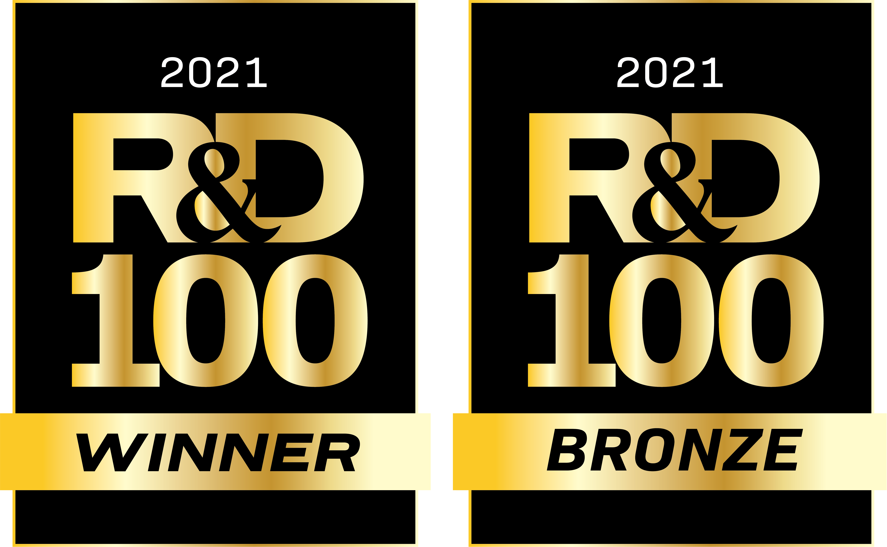

# pyQBTNs - Python Quantum Boolean Tensor Networks

<div align="center", style="font-size: 50px">

[](https://github.com/lanl/pyCP_APR/actions/workflows/ci_tests.yml/badge.svg?branch=main) [](https://img.shields.io/badge/License-BSD%203--Clause-blue.svg) [](https://img.shields.io/badge/python-v3.7.3-blue) [](https://doi.org/10.5281/zenodo.4876527)

</div>

<p align="center">
  
</p>

pyQBTNs is a Python library for boolean matrix and tensor factorization using D-Wave quantum annealers. The library includes five different boolean tensor decomposition methods making up three distinct types of tensor networks.

pyQBTNs allows the user to specify local solvers that do not require a connection to a quantum annealer, but still solve the optimization problems the quantum annealer would solve in the factorization algorithm. In order to use a D-Wave quantum annealer as the solver for this software, the user must set up a D-Wave configuration file. The tensor methods allow for multi-rank factorization, but the current implementation only allows single rank factorization (i.e. one rank used across the entire algorithm).

<div align="center", style="font-size: 50px">

### [:information_source: Documentation](https://lanl.github.io/pyQBTNs/) &emsp; [:orange_book: Examples](examples/) &emsp; [:page_facing_up: Paper 1](https://arxiv.org/abs/2103.07399) &emsp; [:page_facing_up: Paper 2](https://arxiv.org/abs/2107.13659)

</div>

## Installation

#### Option 1: Install using pip
```shell
pip install git+https://github.com/lanl/pyQBTNs
```
#### Option 2: Install from source
```shell
git clone https://github.com/lanl/pyQBTNs
cd pyQBTNs
conda create --name pyQBTNs python=3.9.7
source activate pyQBTNs
python setup.py install
```


## Setup and Verify D-Wave connection
1. Install [pyQBTNs](#installation).
2. Sign up with [D-Wave Leap](https://cloud.dwavesys.com/leap/signup/).
    - Make sure that you have at least 1 minute of QPU time on your free acccount.
3. Set up [D-Wave config file](https://docs.ocean.dwavesys.com/en/stable/overview/sapi.html).
    - You can use either an **Advantage** system or a **2000Q** system, but NOT a **Hybrid** solver. The Hybrid solvers are partially classical solvers, and do not exclusively use quantum annealing to solve optimization problems. 
4. Run an example:
```shell
cd tests
python -m unittest TestMatrixFactorizationQuantum.py
```
**Note:** For more detailed description of the D-Wave setup process see the [tutorials](tutorials/) or the [example notebook on D-Wave](examples/D-Wave_matrix_factorization.ipynb). 

## Example Usage
```python

# Example Boolean Matrix Factorization

from pyQBTNs import QBTNs
import numpy as np

qbtns = QBTNs(factorization_method="Matrix_Factorization", solver_method="classical-simulated-annealing")

p = 0.7 ### Bernoulli boolean density parameter
N1 = 10 ### Dimension 1
N2 = 10 ### Dimension 2
RANK = 3 ### Factorization rank

np.random.seed(42)
A = np.random.choice(a=[False, True], size=(N1, RANK), p=[p, 1-p])
A = np.array(A, dtype=bool)
B = np.random.choice(a=[False, True], size=(RANK, N2), p=[p, 1-p])
B = np.array(B, dtype=bool)
X = np.matmul(A, B)

print("A =", A)
print("B =", B)
print("X =", X)

print("X dimensions =", X.shape)

qbtns.fit(X, RANK)

print("Hamming distance =", qbtns.get_score())

A_prime, B_prime = qbtns.get_factors()
print("A_prime =", A_prime)
print("B_prime =", B_prime)

print("Reconstructed Matrix =", qbtns.get_reconstructed_tensor())

```

## Prerequisites
- [Anaconda](https://docs.anaconda.com/anaconda/install/)(Optional)
- pyparsing==2.4.7
- decorator==4.3.0
- dwave-ocean-sdk>=3.3.0
- numpy>=1.19.4
- tensorly>=0.4.5
- networkx>=2.5
- nimfa>=1.4.0
- scikit-learn>=0.24.1
- matplotlib>=3.4.2
- Pillow>=8.2.0
- symengine>=0.8.1

## How to Cite pyQBTNs?
```latex
@MISC{Pelofske2021_pyQBTNs,
    author = {E. {Pelofske} and H. {Djidjev} and D. {O'Malley} and M. E. {Eren} and B. S. {Alexandrov}},
    title = {pyQBTNs},
    year = {2021},
    publisher = {GitHub},
    journal = {GitHub repository},
    doi = {10.5281/zenodo.4876527},
    howpublished = {\url{https://github.com/lanl/pyQBTNs}}
}

@inproceedings{pelofske2021boolean,
  title={Boolean hierarchical tucker networks on quantum annealers},
  author={Pelofske, Elijah and Hahn, Georg and O’Malley, Daniel and Djidjev, Hristo N and Alexandrov, Boian S},
  booktitle={International Conference on Large-Scale Scientific Computing},
  pages={351--358},
  year={2021},
  organization={Springer}
}

@article{pelofske2022quantum,
  title={Quantum annealing algorithms for Boolean tensor networks},
  author={Pelofske, Elijah and Hahn, Georg and O’Malley, Daniel and Djidjev, Hristo N and Alexandrov, Boian S},
  journal={Scientific Reports},
  volume={12},
  number={1},
  pages={1--19},
  year={2022},
  publisher={Nature Publishing Group}
}
```


## Authors
- [Elijah Pelofske](mailto:epelofske@lanl.gov): Information Sciences, Los Alamos National Laboratory
- [Hristo Djidjev](mailto:hdjidjev@msn.com): Information Sciences, Los Alamos National Laboratory and Institute of Information and Communication Technologies, Sofia, Bulgaria
- [Dan O'Malley](mailto:omalled@lanl.gov): Computational Earth Science, Los Alamos National Laboratory
- [Maksim E. Eren](mailto:maksim@lanl.gov): Advanced Research in Cyber Systems, Los Alamos National Laboratory
- [Boian S. Alexandrov](mailto:boian@lanl.gov): Theoretical Division, Los Alamos National Laboratory

## Copyright Notice:
© 2021. Triad National Security, LLC. All rights reserved.
This program was produced under U.S. Government contract 89233218CNA000001 for Los Alamos
National Laboratory (LANL), which is operated by Triad National Security, LLC for the U.S.
Department of Energy/National Nuclear Security Administration. All rights in the program are
reserved by Triad National Security, LLC, and the U.S. Department of Energy/National Nuclear
Security Administration. The Government is granted for itself and others acting on its behalf a
nonexclusive, paid-up, irrevocable worldwide license in this material to reproduce, prepare
derivative works, distribute copies to the public, perform publicly and display publicly, and to permit
others to do so.

**LANL C Number: C21027**

## License:
This program is open source under the BSD-3 License.
Redistribution and use in source and binary forms, with or without modification, are permitted
provided that the following conditions are met:
1. Redistributions of source code must retain the above copyright notice, this list of conditions and
the following disclaimer.
 
2. Redistributions in binary form must reproduce the above copyright notice, this list of conditions
and the following disclaimer in the documentation and/or other materials provided with the
distribution.
 
3. Neither the name of the copyright holder nor the names of its contributors may be used to endorse
or promote products derived from this software without specific prior written permission.

THIS SOFTWARE IS PROVIDED BY THE COPYRIGHT HOLDERS AND CONTRIBUTORS "AS
IS" AND ANY EXPRESS OR IMPLIED WARRANTIES, INCLUDING, BUT NOT LIMITED TO, THE
IMPLIED WARRANTIES OF MERCHANTABILITY AND FITNESS FOR A PARTICULAR
PURPOSE ARE DISCLAIMED. IN NO EVENT SHALL THE COPYRIGHT HOLDER OR
CONTRIBUTORS BE LIABLE FOR ANY DIRECT, INDIRECT, INCIDENTAL, SPECIAL,
EXEMPLARY, OR CONSEQUENTIAL DAMAGES (INCLUDING, BUT NOT LIMITED TO,
PROCUREMENT OF SUBSTITUTE GOODS OR SERVICES; LOSS OF USE, DATA, OR PROFITS;
OR BUSINESS INTERRUPTION) HOWEVER CAUSED AND ON ANY THEORY OF LIABILITY,
WHETHER IN CONTRACT, STRICT LIABILITY, OR TORT (INCLUDING NEGLIGENCE OR
OTHERWISE) ARISING IN ANY WAY OUT OF THE USE OF THIS SOFTWARE, EVEN IF
ADVISED OF THE POSSIBILITY OF SUCH DAMAGE.


## References
[1] D. O’Malley, H. N. Djidjev and B. S. Alexandrov, "Tucker-1 Boolean Tensor Factorization with Quantum Annealers," 2020 International Conference on Rebooting Computing (ICRC), 2020, pp. 58-65, doi: 10.1109/ICRC2020.2020.00002.
